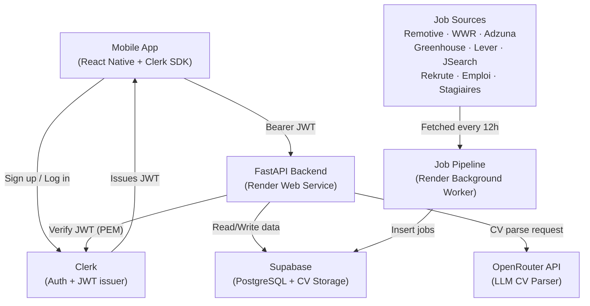

# SwipTurn — Unified Backend Master Plan

This document synthesizes the original backend architecture with the updated V4 database schema, visa logic, and profile scoring mechanisms. It serves as the definitive source of truth for building the SwipTurn backend.

## 1. Architecture Overview



**Key Technology Choices:**

- **Auth:** Clerk + JWT PEM verification (No auth code to maintain)
- **Database:** Supabase (Managed PostgreSQL)
- **CV Storage:** Supabase Storage (Private bucket + 1h signed URLs)
- **CV Parsing:** OpenRouter (`google/gemini-flash-1.5`) + `pypdf`
- **Hosting:** Render (FastAPI Web Service + Pipeline Background Worker)

---

## 2. Global V1 vs V2 Scope

| Feature | Scope |
|---|---|
| Auth (Clerk), DB (Supabase), hosting (Render) | V1 |
| All 9 job pipeline sources | V1 |
| CV upload + OpenRouter parsing | V1 |
| Basic matching (keyword scoring) | V1 |
| Swipe limit (10/day free) | V1 |
| `target_locations`, `languages`, `work_authorization` mapping | V1 |
| Profile completion score | V1 |
| Advanced Salary filter in feed | V2 |
| Auto-apply (cover letter + Playwright) | V2 |
| Push notifications | V2 |

---

## 3. Unified Database Schema (V4)

Run this in the Supabase SQL Editor. It includes the original tables plus the 7 new User columns and 2 new Job columns.

```sql
CREATE TABLE users (
  id UUID PRIMARY KEY DEFAULT gen_random_uuid(),
  clerk_user_id VARCHAR UNIQUE NOT NULL,
  email VARCHAR,
  name VARCHAR,
  cv_storage_path VARCHAR,
  cv_text TEXT,
  extracted_skills JSONB DEFAULT '[]',
  experience_level VARCHAR DEFAULT 'student',
  fields JSONB DEFAULT '[]',
  preferences JSONB DEFAULT '{}',
  
  -- V4 Additions
  target_locations JSONB DEFAULT '[]',
  languages JSONB DEFAULT '[]',
  linkedin_url VARCHAR,
  portfolio_url VARCHAR,
  work_authorization VARCHAR DEFAULT 'moroccan_no_visa',
  desired_salary_min INTEGER,
  metadata JSONB DEFAULT '{}',

  subscription VARCHAR DEFAULT 'free',
  subscription_expires_at TIMESTAMP,
  swipes_today INTEGER DEFAULT 0,
  swipes_reset_at TIMESTAMP DEFAULT NOW(),
  created_at TIMESTAMP DEFAULT NOW()
);

CREATE TABLE jobs (
  id UUID PRIMARY KEY DEFAULT gen_random_uuid(),
  title VARCHAR NOT NULL,
  company VARCHAR NOT NULL,
  company_logo_url VARCHAR,
  location VARCHAR,
  is_remote BOOLEAN DEFAULT false,
  type VARCHAR,
  description TEXT,
  required_skills JSONB DEFAULT '[]',
  
  -- V4 Additions
  visa_sponsorship BOOLEAN DEFAULT false,
  open_to_intl BOOLEAN DEFAULT false,

  apply_url VARCHAR,
  apply_email VARCHAR,
  apply_type VARCHAR DEFAULT 'url',
  source VARCHAR,
  source_id VARCHAR UNIQUE,
  posted_at TIMESTAMP,
  scraped_at TIMESTAMP DEFAULT NOW(),
  is_active BOOLEAN DEFAULT true,
  expires_at TIMESTAMP
);

CREATE TABLE swipes (
  id UUID PRIMARY KEY DEFAULT gen_random_uuid(),
  user_id UUID REFERENCES users(id) ON DELETE CASCADE,
  job_id UUID REFERENCES jobs(id) ON DELETE CASCADE,
  direction VARCHAR NOT NULL,
  created_at TIMESTAMP DEFAULT NOW()
);

CREATE TABLE applications (
  id UUID PRIMARY KEY DEFAULT gen_random_uuid(),
  user_id UUID REFERENCES users(id) ON DELETE CASCADE,
  job_id UUID REFERENCES jobs(id) ON DELETE CASCADE,
  status VARCHAR DEFAULT 'saved',
  applied_at TIMESTAMP,
  apply_method VARCHAR,
  cover_letter_used TEXT,
  notes TEXT
);

CREATE INDEX idx_jobs_active ON jobs(is_active);
CREATE INDEX idx_jobs_source_id ON jobs(source_id);
CREATE INDEX idx_swipes_user ON swipes(user_id);
CREATE INDEX idx_swipes_job ON swipes(job_id);
```

---

## 4. Backend Logic Specifications

### 4.1 Profile Completion Score (`GET /users/me`)

Computed on the fly when fetching the user profile to power the frontend progress bar.

```python
def compute_profile_score(user: dict) -> int:
    score = 0
    if user.get("cv_url"):              score += 30
    if len(user.get("extracted_skills", [])) >= 3:  score += 20
    if user.get("linkedin_url"):        score += 15
    if user.get("preferences"):         score += 15
    if user.get("target_locations"):    score += 10
    if user.get("languages"):           score += 10
    return score   # max 100
```

### 4.2 Job Pipeline Visa Detection

During the scraping process (`pipeline/processor.py`), the description text is analyzed to set the `visa_sponsorship` and `open_to_intl` flags.

```python
OPEN_TO_INTL_KEYWORDS = [
    "open to international", "worldwide", "any nationality",
    "global candidates", "all nationalities", "international applicants",
    "moroccan", "morocco", "north africa", "afrique du nord",
    "mena", "maghreb", "maroc", "no visa required",
    "remote worldwide", "100% remote"
]

VISA_SPONSORSHIP_KEYWORDS = [
    "visa sponsorship", "sponsor work permit", "relocation package",
    "work permit provided", "visa provided", "tier 2 sponsor",
    "h-1b sponsor", "we sponsor", "relocation assistance"
]
```

### 4.3 Feed Visa Filtering (`GET /jobs/feed`)

When the API scores and returns the feed, it evaluates if the user requires Visa badges based on their target locations.

```python
# Only apply visa logic when user targets remote/EU jobs
INTL_PREF_TYPES = [
    "Full-time Remote Job", "Remote Internship",
    "Part-time", "Freelance", "Contract"
]

user_wants_intl = any(t in INTL_PREF_TYPES for t in prefs.get("types", []))

if user_wants_intl:
    for job in jobs:
        job["visa_badge"] = (
            "sponsored"     if job["visa_sponsorship"]  else
            "open_to_intl"  if job["open_to_intl"]      else
            "visa_required" if job["location"] not in ["Remote","Morocco"] else
            None
        )
```

---

## 5. Implementation Phases

We will build the backend by following these sequential phases:

1. **Phase 1: Backend Core:** Setup FastAPI, dependencies, CORS, and health checks.
2. **Phase 2: User Endpoints:** Setup the CV parsing engine (OpenRouter), `/users/me` endpoint with signed URLs, and profile patching.
3. **Phase 3: Matching & Feed:** Implement the keyword extraction matching engine and the swipe endpoints (`/jobs/feed`, `/swipes`).
4. **Phase 4: Job Pipeline:** Setup the pipeline worker to scrape the 9 sources and insert them into Supabase.
5. **Phase 5: Deployment:** Deploy both the FastAPI app and the Pipeline worker to Render.
