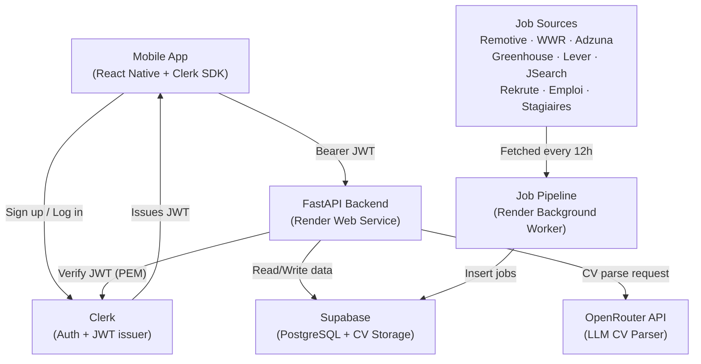

## Objective

Build the complete SwipTurn backend in `backend/` and `pipeline/` folders inside `C:\Users\Mouaad\Documents\SwipTurn-New\`, fully deployable on Render with zero cost at launch.

---

## Architecture



---

## Phase 0 — External Services Setup (manual, one-time)

> Do these before writing any code. Each step gives you the keys needed for `.env`.

### 0.1 Supabase

- Go to [supabase.com](https://supabase.com) → New project
- Save: **Project URL**, **anon key**, **service_role key** (Settings → API)
- Go to **SQL Editor** → Run the full schema (below)
- Go to **Storage** → New bucket → name: `cvs` → **Private: ON**

```sql
CREATE TABLE users (
  id UUID PRIMARY KEY DEFAULT gen_random_uuid(),
  clerk_user_id VARCHAR UNIQUE NOT NULL,
  email VARCHAR,
  name VARCHAR,
  cv_storage_path VARCHAR,
  cv_text TEXT,
  extracted_skills JSONB DEFAULT '[]',
  experience_level VARCHAR DEFAULT 'student',
  fields JSONB DEFAULT '[]',
  preferences JSONB DEFAULT '{}',
  subscription VARCHAR DEFAULT 'free',
  subscription_expires_at TIMESTAMP,
  swipes_today INTEGER DEFAULT 0,
  swipes_reset_at TIMESTAMP DEFAULT NOW(),
  created_at TIMESTAMP DEFAULT NOW()
);

CREATE TABLE jobs (
  id UUID PRIMARY KEY DEFAULT gen_random_uuid(),
  title VARCHAR NOT NULL,
  company VARCHAR NOT NULL,
  company_logo_url VARCHAR,
  location VARCHAR,
  is_remote BOOLEAN DEFAULT false,
  type VARCHAR,
  description TEXT,
  required_skills JSONB DEFAULT '[]',
  apply_url VARCHAR,
  apply_email VARCHAR,
  apply_type VARCHAR DEFAULT 'url',
  source VARCHAR,
  source_id VARCHAR UNIQUE,
  posted_at TIMESTAMP,
  scraped_at TIMESTAMP DEFAULT NOW(),
  is_active BOOLEAN DEFAULT true,
  expires_at TIMESTAMP
);

CREATE TABLE swipes (
  id UUID PRIMARY KEY DEFAULT gen_random_uuid(),
  user_id UUID REFERENCES users(id) ON DELETE CASCADE,
  job_id UUID REFERENCES jobs(id) ON DELETE CASCADE,
  direction VARCHAR NOT NULL,
  created_at TIMESTAMP DEFAULT NOW()
);

CREATE TABLE applications (
  id UUID PRIMARY KEY DEFAULT gen_random_uuid(),
  user_id UUID REFERENCES users(id) ON DELETE CASCADE,
  job_id UUID REFERENCES jobs(id) ON DELETE CASCADE,
  status VARCHAR DEFAULT 'saved',
  applied_at TIMESTAMP,
  apply_method VARCHAR,
  cover_letter_used TEXT,
  notes TEXT
);

CREATE INDEX idx_jobs_active ON jobs(is_active);
CREATE INDEX idx_jobs_source_id ON jobs(source_id);
CREATE INDEX idx_swipes_user ON swipes(user_id);
CREATE INDEX idx_swipes_job ON swipes(job_id);
```

> Note: `cv_url` renamed to `cv_storage_path` — stores the Supabase storage path (e.g. `cv_user-id.pdf`), not a URL. A fresh signed URL is generated on every `/users/me` request.

### 0.2 Clerk

- Go to [clerk.com](https://clerk.com) → Create application
- Enable **Email/Password** sign-in
- Go to **API Keys** → copy **Publishable Key** + **Secret Key**
- Go to **JWT Templates** → Create → Blank template → name: `swipturn`
  - Add claims: `{ "email": "{{user.primary_email_address}}", "name": "{{user.full_name}}" }`
  - Copy the **PEM public key** (Signing Key section)
- Go to **Native Applications** → Enable

### 0.3 OpenRouter

- Go to [openrouter.ai](https://openrouter.ai) → Sign up → Keys → Create key
- Add $5 credit (enough for ~5,000 CV parses at $0.001 each)

### 0.4 Adzuna

- Go to [developer.adzuna.com](https://developer.adzuna.com) → Register → get **App ID** + **App Key** (free)

### 0.5 JSearch (RapidAPI)

- Go to [rapidapi.com](https://rapidapi.com) → search "JSearch" → Subscribe to free tier → copy **X-RapidAPI-Key**

---

## Phase 1 — Backend Core

**Target files:**

```
backend/
├── main.py
├── config.py
├── dependencies.py
├── requirements.txt
├── .env.example
├── routers/__init__.py
└── services/__init__.py
```

### 1.1 Create folder + venv

```powershell
New-Item -ItemType Directory -Force -Path "backend\routers","backend\services"
cd backend
py -m venv venv
.\venv\Scripts\Activate.ps1
```

### 1.2 `backend/requirements.txt`

```
fastapi>=0.115.0
uvicorn[standard]>=0.32.0
python-dotenv>=1.0.0
supabase>=2.10.0
python-jose[cryptography]>=3.3.0
pypdf>=4.0.0
python-docx>=1.1.0
requests>=2.32.0
python-multipart>=0.0.12
httpx>=0.27.0
```

> `pypdf` replaces `pdfminer.six` — actively maintained, confirmed Python 3.14 compatible.

### 1.3 `backend/.env.example`

```
SUPABASE_URL=https://xxxx.supabase.co
SUPABASE_KEY=your-anon-key
SUPABASE_SERVICE_KEY=your-service-role-key
CLERK_PEM_KEY="-----BEGIN PUBLIC KEY-----\nXXX\n-----END PUBLIC KEY-----"
OPENROUTER_API_KEY=sk-or-xxxx
```

### 1.4 `backend/config.py`

```python
import os
from dotenv import load_dotenv
load_dotenv()

SUPABASE_URL = os.getenv("SUPABASE_URL")
SUPABASE_KEY = os.getenv("SUPABASE_KEY")
SUPABASE_SERVICE_KEY = os.getenv("SUPABASE_SERVICE_KEY")
CLERK_PEM_KEY = os.getenv("CLERK_PEM_KEY", "").replace("\\n", "\n")
OPENROUTER_API_KEY = os.getenv("OPENROUTER_API_KEY")
```

> `.replace("\\n", "\n")` handles PEM keys stored as single-line strings in env files.

### 1.5 `backend/dependencies.py`

- Supabase client initialized once at module level (service key for admin writes)
- `get_current_user_id(authorization)` → verifies Clerk RS256 JWT → returns `clerk_user_id`
- `get_current_user(clerk_id)` → fetches user row OR auto-creates it with email/name from JWT claims
- Returns the full user dict from Supabase

### 1.6 `backend/main.py`

- `FastAPI(title="Swipturn API")`
- CORS middleware: `allow_origins=["*"]` for MVP
- Routers: `/users`, `/jobs`, `/swipes`
- `GET /health` → `{"status": "ok", "version": "1.0.0"}`

**✅ Phase 1 Done when:** `uvicorn main:app --reload` starts, `GET /health` returns 200, Supabase tables visible in dashboard.

---

## Phase 2 — User Endpoints

**Target files:**

```
backend/services/cv_parser.py
backend/routers/users.py
```

### 2.1 `backend/services/cv_parser.py`

- `extract_text_from_pdf(path)` → uses `pypdf.PdfReader`, concatenates all page text
- `extract_text_from_docx(path)` → uses `python-docx`, joins paragraph text
- `parse_cv(cv_text)` → POST to OpenRouter `google/gemini-flash-1.5` with structured JSON prompt
  - Returns: `{ "skills": [...], "experience_level": "student|junior|mid", "fields": [...] }`
  - Strips markdown code fences before `json.loads()`
  - Falls back to `{"skills": [], "experience_level": "student", "fields": []}` on parse error

### 2.2 `backend/routers/users.py`

Three endpoints:

**`GET /users/me`**

- Calls `get_current_user`
- If user has `cv_storage_path`, generates a **signed URL**: `supabase.storage.from_("cvs").create_signed_url(path, expires_in=3600)` (1 hour)
- Returns user dict with `cv_url` (signed URL) injected

**`PATCH /users/preferences`**

- Body: `{ "preferences": { "types": [...], "fields": [...] } }`
- Updates `preferences` JSONB column for the user

**`POST /users/cv`**

- Accepts `multipart/form-data` with `file: UploadFile`
- Validates: only `.pdf` or `.docx`, max 5MB
- Writes to `tempfile`, calls `extract_text()` + `parse_cv()`
- Uploads to Supabase Storage `cvs` bucket as `cv_{user_id}.pdf` (upsert)
- Stores **path only** in `cv_storage_path` column (not a URL)
- Updates `extracted_skills`, `experience_level`, `fields`, `cv_text` in DB
- Returns `{ "success": true, "data": { "skills": [...], "cv_url": "<signed_url>" } }`
- `finally:` block always deletes the temp file

**✅ Phase 2 Done when:** Upload a real PDF → skills appear in Supabase `users` table → signed URL works in browser.

---

## Phase 3 — Matching Engine + Jobs + Swipes

**Target files:**

```
backend/services/matching.py
backend/routers/jobs.py
backend/routers/swipes.py
```

### 3.1 `backend/services/matching.py`

- `calculate_match_score(user_skills, job_skills)` → returns `float` 0–100 (keyword intersection %)
  - Returns `40.0` if job has no listed skills (neutral, not 0)
- `get_skill_breakdown(user_skills, job_skills)` → returns `{"matched": [...], "missing": [...]}`

### 3.2 `backend/routers/jobs.py`

**`GET /jobs/feed`** — query params: `page=1`, `limit=20`

- Fetches all job IDs already swiped by user (exclude from feed)
- Fetches active jobs from Supabase
- Filters by user preferences (remote if `preferences.types` includes remote types)
- Scores every job with `calculate_match_score` + adds `matched_skills` / `missing_skills`
- Sorts by `match_score` descending
- Returns paginated result: `{ "jobs": [...], "total": N, "page": N }`

**`GET /jobs/{job_id}`**

- Fetches single job, injects `match_score` and skill breakdown for current user

### 3.3 `backend/routers/swipes.py`

**`POST /swipes`** — body: `{ "job_id": "...", "direction": "left|right" }`

- Resets daily counter if `swipes_reset_at` is a past date
- Enforces free tier limit: `FREE_SWIPE_LIMIT = 10` → raises HTTP 403 with clear message
- Inserts swipe record + increments `swipes_today`

**`GET /swipes/saved`**

- Returns all right-swipes for the user with full job data joined (`select "*, jobs(*)"`)
- Ordered by `created_at` descending

**✅ Phase 3 Done when:** Feed returns scored jobs, swiped jobs don't reappear, free user gets 403 on the 11th swipe.

---

## Phase 4 — Job Pipeline

**Target files:**

```
pipeline/
├── requirements.txt
├── .env.example
├── processor.py
├── scheduler.py
└── sources/
    ├── remotive.py       (free API, no key)
    ├── weworkremotely.py (free RSS)
    ├── adzuna.py         (free key)
    ├── greenhouse.py     (free, no key, 25 companies)
    ├── lever.py          (free, no key, 10 companies)
    ├── jsearch.py        (500 req/month free)
    ├── rekrute.py        (Scrapling)
    ├── emploi.py         (Scrapling)
    └── stagiaires.py     (Scrapling)
```

### 4.1 `pipeline/requirements.txt`

```
requests>=2.32.0
beautifulsoup4>=4.12.0
lxml>=5.0.0
schedule>=1.2.0
supabase>=2.10.0
python-dotenv>=1.0.0
scrapling[fetchers]>=0.2.0
```

> `lxml` is required for `BeautifulSoup(content, "xml")` used in WeWorkRemotely RSS parsing.

### 4.2 `pipeline/.env.example`

```
SUPABASE_URL=https://xxxx.supabase.co
SUPABASE_KEY=your-anon-key
ADZUNA_APP_ID=your-adzuna-app-id
ADZUNA_APP_KEY=your-adzuna-app-key
JSEARCH_API_KEY=your-rapidapi-key
```

### 4.3 `pipeline/sources/` — All 9 sources

Each source follows the same contract:

- Single function `fetch_SOURCE() -> list[dict]`
- Returns list of job dicts matching the `jobs` table schema
- Every failure is caught with `try/except`, prints error, continues
- Each job has a `source_id` formatted as `"source_jobid"` (used for deduplication)

| Source | Method | Key? | Est. jobs/run |
|--------|--------|------|---------------|
| `remotive.py` | REST JSON API | None | ~100 |
| `weworkremotely.py` | RSS + BeautifulSoup | None | ~80 |
| `adzuna.py` | REST API (5 EU countries) | Free registration | ~250 |
| `greenhouse.py` | REST API (25 companies) | None | ~200 |
| `lever.py` | REST API (10 companies) | None | ~80 |
| `jsearch.py` | RapidAPI (8 queries) | Free 500/month | ~160 |
| `rekrute.py` | Scrapling StealthyFetcher | None | ~30 |
| `emploi.py` | Scrapling StealthyFetcher | None | ~20 |
| `stagiaires.py` | Scrapling StealthyFetcher | None | ~20 |

> `emploi.py` and `stagiaires.py` will be fully implemented (not "same pattern" stub) with their correct CSS selectors.

> **Scrapling note**: Python 3.14 support for Scrapling's Playwright-based `StealthyFetcher` may require `scrapling install` post-pip. If Playwright fails on 3.14, the Moroccan scrapers fall back gracefully (caught in `try/except`).

### 4.4 `pipeline/processor.py`

- Uses `config.py` pattern (load_dotenv + os.getenv) — consistent with backend
- `SKILLS` list: ~40 known tech keywords for auto-extraction from description text
- `extract_skills(text)` → returns matched skills from description
- `process_jobs(raw_jobs)` → deduplicates by `source_id`, auto-extracts skills if empty, sets `expires_at = now + 60 days`, inserts to Supabase
- `deactivate_expired()` → marks `is_active = false` for expired jobs
- Returns `{ "new": N, "skipped": N }`

### 4.5 `pipeline/scheduler.py`

- Runs all 9 sources in order, calls `process_jobs()` for each
- Calls `deactivate_expired()` after each full run
- `schedule.every(12).hours.do(run_pipeline)`
- Runs once immediately on startup, then every 12h

**✅ Phase 4 Done when:** `py scheduler.py` → 100+ jobs visible in Supabase `jobs` table, second run adds zero duplicates.

---

## Phase 5 — Deploy on Render

**Target files:**

```
backend/render.yaml  (or use Render dashboard directly)
pipeline/render.yaml
```

### 5.1 `backend/render.yaml`

```yaml
services:
  - type: web
    name: swipturn-api
    runtime: python
    buildCommand: pip install -r requirements.txt
    startCommand: uvicorn main:app --host 0.0.0.0 --port $PORT
    envVars:
      - key: SUPABASE_URL
        sync: false
      - key: SUPABASE_KEY
        sync: false
      - key: SUPABASE_SERVICE_KEY
        sync: false
      - key: CLERK_PEM_KEY
        sync: false
      - key: OPENROUTER_API_KEY
        sync: false
```

### 5.2 `pipeline/render.yaml`

```yaml
services:
  - type: worker
    name: swipturn-pipeline
    runtime: python
    buildCommand: pip install -r requirements.txt && scrapling install
    startCommand: python scheduler.py
    envVars:
      - key: SUPABASE_URL
        sync: false
      - key: SUPABASE_KEY
        sync: false
      - key: ADZUNA_APP_ID
        sync: false
      - key: ADZUNA_APP_KEY
        sync: false
      - key: JSEARCH_API_KEY
        sync: false
```

### 5.3 Deploy steps

1. Push full repo to GitHub
2. Render → New Web Service → root dir: `backend` → add all env vars
3. Render → New Background Worker → root dir: `pipeline` → add all env vars
4. Trigger pipeline manually once → check Supabase for 100+ jobs

**✅ Phase 5 Done when:** `https://swipturn-api.onrender.com/health` returns 200, Supabase has real jobs.

---

## Phase 6 — Step Logs

A `step-logs/` entry created after each phase:

| Log file | Content |
|----------|---------|
| `step-logs/step-backend-0/STEP_BACKEND_0_LOG.md` | Services setup guide, SQL schema, keys needed |
| `step-logs/step-backend-1/STEP_BACKEND_1_LOG.md` | Core FastAPI setup, deps, config |
| `step-logs/step-backend-2/STEP_BACKEND_2_LOG.md` | CV parser, user endpoints, signed URLs |
| `step-logs/step-backend-3/STEP_BACKEND_3_LOG.md` | Matching engine, jobs/swipes API |
| `step-logs/step-backend-4/STEP_BACKEND_4_LOG.md` | All 9 pipeline sources, processor, scheduler |
| `step-logs/step-backend-5/STEP_BACKEND_5_LOG.md` | Render deployment, baseURL, final checklist |

---

## Verification / DoD Traceability

| Phase | Files | Verification |
|-------|-------|-------------|
| 1 | `main.py`, `config.py`, `dependencies.py` | `GET /health` → 200 |
| 2 | `cv_parser.py`, `routers/users.py` | Upload PDF → skills in DB, file in Supabase Storage |
| 3 | `matching.py`, `jobs.py`, `swipes.py` | Feed sorted by match, swiped jobs excluded, free limit enforced |
| 4 | All 9 sources, `processor.py`, `scheduler.py` | 100+ jobs in DB, idempotent on second run |
| 5 | `render.yaml` × 2 | Live URL returns 200, pipeline worker running |

---

## Key Decisions Summary

| Decision | Choice | Reason |
|----------|--------|--------|
| Auth | Clerk + JWT PEM verification | No auth code to maintain |
| DB | Supabase (managed PostgreSQL) | Free tier, built-in storage, dashboard |
| CV storage | Private bucket + signed URLs | CVs are personal, URLs expire in 1h |
| CV parsing | `pypdf` (not `pdfminer.six`) | Python 3.14 compatible, actively maintained |
| Hosting | Render (API + worker) | Genuine free tier, Railway costs $5+/month |
| Pipeline | 9 sources in one worker | ~940 new jobs per run, all free or near-free |
