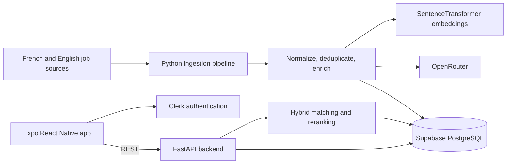

# SwipeTurn

<p align="center">
  
</p>

<p align="center">
  <a href="https://expo.dev"></a>
  <a href="https://reactnative.dev"></a>
  <a href="https://fastapi.tiangolo.com"></a>
  <a href="https://www.python.org"></a>
  <a href="LICENSE"></a>
</p>

SwipeTurn is a full-stack mobile job discovery application for Moroccan candidates and international remote roles. It aggregates French and English job listings, enriches and normalizes them, and presents a personalized swipe-based feed powered by CV and preference matching.

> The application is not currently hosted publicly. The screenshots below were captured from SwipeTurn release builds.

## Table of contents

- [Overview](#overview)
- [App preview](#app-preview)
- [Architecture](#architecture)
- [Features](#features)
- [Technology stack](#technology-stack)
- [Getting started](#getting-started)
  - [Prerequisites](#prerequisites)
  - [Environment variables](#environment-variables)
  - [Run the backend](#run-the-backend)
  - [Run the pipeline](#run-the-pipeline)
  - [Run the mobile app](#run-the-mobile-app)
  - [Run with Docker](#run-with-docker)
- [Project structure](#project-structure)
- [License](#license)

## Overview

SwipeTurn brings job listings from Moroccan platforms and global remote-job sources into one mobile experience. The project includes:

- An Expo React Native application for onboarding, job discovery, search, saved jobs, and profile management.
- A FastAPI backend for authentication, profiles, CV processing, recommendations, and swipe history.
- A scheduled Python pipeline for scraping, API ingestion, normalization, deduplication, LLM enrichment, and embeddings.
- A hybrid matching engine combining profile preferences, skills, semantic similarity, and cross-encoder reranking.

The active pipeline integrates six sources: Rekrute, Stagiaires.ma, Remotive, WeWorkRemotely, RemoteOK, and JSearch.

## App preview

<table>
  <tr>
    <td align="center"><br/><sub>Welcome and guest access</sub></td>
    <td align="center"><br/><sub>Preferences and CV upload</sub></td>
    <td align="center"><br/><sub>Personalized job feed</sub></td>
  </tr>
  <tr>
    <td align="center"><br/><sub>Swipe right to save</sub></td>
    <td align="center"><br/><sub>Saved jobs and applications</sub></td>
  </tr>
</table>

## Architecture



The pipeline runs on startup and every 12 hours. It collects recent jobs, converts source-specific fields into a common format, removes duplicates, enriches incomplete data, generates multilingual embeddings, and stores the results in Supabase. The API then builds personalized feeds from profile, CV, preference, and job signals.

## Features

- Guest access and Clerk authentication with guest-to-account migration.
- Guided onboarding for geography, domains, skills, seniority, and job type.
- PDF and DOCX CV upload with structured skill extraction.
- French and English job ingestion and matching.
- Swipe left to skip and swipe right to save.
- Personalized feed, keyword search, saved jobs, and external application links.
- Hybrid scoring with SentenceTransformer embeddings and cross-encoder reranking.
- Scheduled ingestion with duplicate detection, expiry cleanup, and cached LLM enrichment.

## Technology stack

| Area | Technologies |
|---|---|
| Mobile | Expo 54, React Native 0.81, TypeScript, Expo Router, Zustand, Reanimated |
| Backend | Python 3.12, FastAPI, Uvicorn, Pydantic, httpx |
| Authentication | Clerk, RS256 JWT verification, guest identifiers |
| Database | Supabase PostgreSQL, JSONB fields, stored vector embeddings |
| Matching | SentenceTransformers, multilingual E5, mMiniLM cross-encoder, NumPy |
| Data pipeline | Requests, BeautifulSoup, lxml, Scrapling, python-dateutil, schedule |
| AI integration | OpenRouter for CV extraction and job enrichment |
| Infrastructure | Docker Compose, Caddy, shared Hugging Face model cache, EAS Build |

## Getting started

### Prerequisites

- Node.js 20 or later and Yarn.
- Python 3.12 or later.
- A Supabase project.
- A Clerk application.
- An OpenRouter API key.
- A RapidAPI/JSearch key for the JSearch source.
- Docker and Docker Compose, if using the containerized setup.

Clone the repository:

```bash
git clone https://github.com/mouaad-here/SwipeTurn.git
cd SwipeTurn
```

SwipeTurn expects the Supabase tables used by the backend and pipeline. Checked-in incremental SQL is available in `pipeline/migrations/`; the current repository snapshot does not include a complete database bootstrap migration.

### Environment variables

Environment templates are provided for every component. Copy each required `.env.example` file to `.env` and replace the placeholders.

#### Mobile app — `frontend/.env`

```env
EXPO_PUBLIC_CLERK_PUBLISHABLE_KEY=your_clerk_publishable_key
EXPO_PUBLIC_API_URL=http://192.168.1.10:8003
```

When testing on a physical phone, replace the example address with the development computer's LAN IP. `localhost` would point to the phone itself.

#### Backend — `backend/.env`

```env
SUPABASE_URL=https://your-project.supabase.co
SUPABASE_KEY=your_supabase_publishable_or_anon_key
SUPABASE_SERVICE_KEY=your_supabase_secret_or_service_role_key

CLERK_SECRET_KEY=your_clerk_secret_key
CLERK_PEM_KEY=your_clerk_public_pem_key

OPENROUTER_API_KEY=your_openrouter_api_key
ALLOWED_ORIGINS=http://localhost:8082
```

For `CLERK_PEM_KEY`, represent line breaks as literal `\n` sequences when storing the PEM in an environment file.

#### Pipeline — `pipeline/.env`

```env
SUPABASE_URL=https://your-project.supabase.co
SUPABASE_SERVICE_KEY=your_supabase_secret_or_service_role_key
JSEARCH_API_KEY=your_rapidapi_key
OPENROUTER_API_KEY=your_openrouter_api_key

JOB_MAX_AGE_DAYS=14
LLM_MAX_WORKERS=5
LLM_TIMEOUT_SEC=45
LLM_MAX_RETRIES=2
LLM_DESCRIPTION_MAX_CHARS=6000
LLM_CACHE_ENABLED=true
LLM_CACHE_VERSION=1
LLM_PROGRESS_EVERY_N=10
```

`ADZUNA_APP_ID` and `ADZUNA_APP_KEY` are only required if the currently disabled Adzuna source is enabled.

### Run the backend

```bash
cd backend
python -m venv .venv

# Windows
.venv\Scripts\activate

# macOS/Linux
source .venv/bin/activate

python -m pip install -r requirements.txt
python main.py
```

The API starts at `http://localhost:8003`. Verify it with `GET http://localhost:8003/health`.

The embedding and reranking models are downloaded on first use, so the first startup can take longer than later runs.

### Run the pipeline

```bash
cd pipeline
python -m venv .venv

# Windows
.venv\Scripts\activate

# macOS/Linux
source .venv/bin/activate

python -m pip install -r requirements.txt

# Run one ingestion cycle
python run_once.py

# Or start the 12-hour scheduler
python scheduler.py
```

Running the pipeline calls external sources and may use paid API or LLM credits.

### Run the mobile app

```bash
cd frontend
yarn install
yarn dev
```

Use the Expo development server to open the app on an Android emulator, iOS simulator, or physical device. The project also provides `yarn android`, `yarn ios`, and `yarn web` scripts.

### Run with Docker

After creating `backend/.env` and `pipeline/.env`:

```bash
docker compose up --build
```

Docker Compose starts the FastAPI service, scheduled pipeline, and Caddy reverse proxy. For local mobile development, running the backend directly on port `8003` is simpler. The included Caddy configuration is intended for configured production domains.

## Project structure

```text
SwipeTurn/
├── frontend/              Expo React Native application
├── backend/               FastAPI API and matching services
├── pipeline/              Job sources, normalization, enrichment, scheduler
│   └── migrations/        Incremental Supabase SQL migrations
├── docs/images/           Application release screenshots
├── docker-compose.yml     Container orchestration
├── Caddyfile              Reverse proxy and TLS configuration
└── README.md
```

## License

Released under the [MIT License](LICENSE). Copyright © 2026 [mouaad-here](https://github.com/mouaad-here/SwipeTurn).
