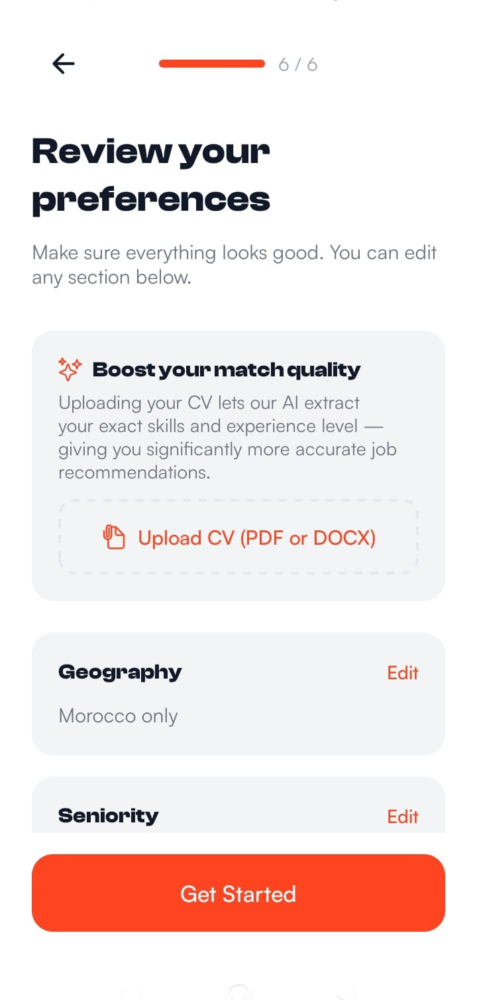
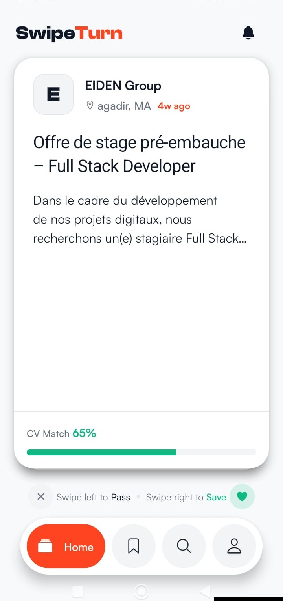
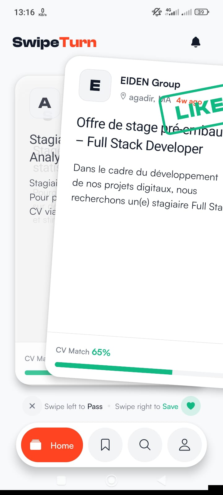
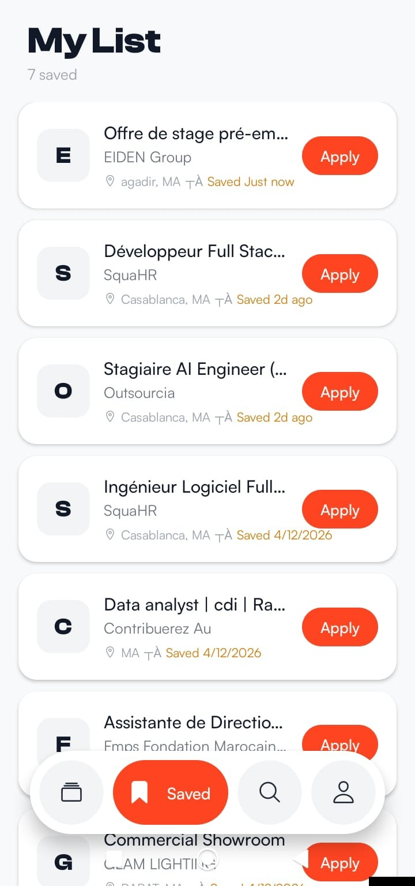
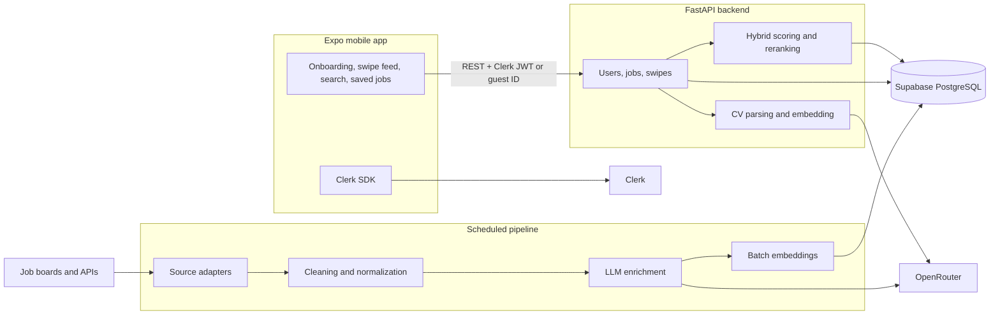
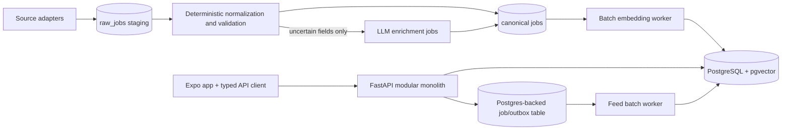

# SwipeTurn

<p align="center">
  
</p>

<p align="center">
  <a href="https://expo.dev"></a>
  <a href="https://reactnative.dev"></a>
  <a href="https://fastapi.tiangolo.com"></a>
  <a href="https://www.python.org"></a>
  <a href="LICENSE"></a>
</p>

SwipeTurn is a mobile job-discovery prototype for Moroccan candidates and international remote roles. It combines a bilingual ingestion pipeline, CV-derived profile signals, and a swipe-based React Native interface.

This repository is also a system-design case study: it documents what was built, where the MVP architecture became costly or fragile, and how I would evolve it without introducing unnecessary infrastructure.

> **Project status:** Portfolio case study. The mobile client, API, matching engine, and ingestion pipeline were implemented, but there is currently no public live app. The screenshots below come from the implemented Android client.

## Problem

Job discovery in the target market is fragmented across Moroccan boards and global remote-job APIs. The sources differ in language, structure, data quality, date formats, location semantics, and eligibility rules.

SwipeTurn explores three engineering questions:

- How can heterogeneous French and English job data be normalized into one searchable model?
- How useful can personalized ranking be with incomplete profiles and noisy job descriptions?
- How can LLM and embedding features be used within the cost and operational limits of a small portfolio deployment?

## Evidence-backed scope

These values come from repository code or the checked-in job-corpus audit. They describe implementation scope, not unmeasured production traffic or business impact.

| Measure | Verified value | Source |
|---|---:|---|
| Jobs in the saved corpus audit | **838** | [`subcategories_from_db.json`](backend/scripts/output/subcategories_from_db.json) |
| Morocco/global split in that audit | **533 / 305** | Same audit snapshot |
| Currently enabled ingestion sources | **6** | Rekrute, Stagiaires, Remotive, WeWorkRemotely, RemoteOK, JSearch |
| Pipeline cadence | **Every 12 hours** | `pipeline/scheduler.py` |
| Cross-source fuzzy duplicate threshold | **93% title similarity** | `pipeline/processor.py` |
| Embedding size | **384 dimensions** | Multilingual E5 model output |
| Feed candidates considered per batch | **Up to 1,000** | `backend/routers/jobs.py` |
| Default daily feed batch | **25 jobs** | `DAILY_BATCH_SIZE` |
| Cross-encoder reranking window | **Top 15 jobs** | `backend/services/reranker.py` |
| Pipeline LLM fallback chain | **3 models** | `pipeline/llm_enrichment.py` |

The audit snapshot predates the final source selection and includes Adzuna data, which is now disabled. I do not claim active-user, uptime, conversion, or latency metrics because those were not measured in a production deployment.

## UI showcase

<table>
  <tr>
    <td align="center"><br/><sub>Welcome and guest entry</sub></td>
    <td align="center"><br/><sub>Preference review and CV upload</sub></td>
    <td align="center"><br/><sub>French job and CV match signal</sub></td>
  </tr>
  <tr>
    <td align="center"><br/><sub>Swipe right to save</sub></td>
    <td align="center"><br/><sub>Saved jobs and apply actions</sub></td>
  </tr>
</table>

## Current implementation

### Architecture



The system is deployed as a small monorepo.

### Technology stack

| Area | Technologies |
|---|---|
| Mobile | Expo 54, React Native 0.81, TypeScript, Expo Router, Zustand, Reanimated, Gesture Handler |
| Identity | Clerk SDK, RS256 JWTs, guest identifiers |
| Backend | Python 3.12, FastAPI, Uvicorn, Pydantic, Supabase Python client, httpx |
| ML and retrieval | SentenceTransformers, multilingual E5, mMiniLM cross-encoder, NumPy cosine similarity |
| CV processing | pypdf, python-docx, OpenRouter structured extraction |
| Ingestion | Requests, BeautifulSoup, lxml, Scrapling, python-dateutil, schedule |
| Data | Supabase PostgreSQL, JSONB fields, stored 384-dimensional vectors |
| Infrastructure | Docker Compose, Caddy, shared Hugging Face cache, EAS Build |

### Responsibilities

| Component | Current responsibility |
|---|---|
| Mobile app | Authentication UX, onboarding, CV selection, swipe gestures, search, saved jobs, local boot/cache state |
| FastAPI API | Identity resolution, profile updates, CV processing, feed generation, matching, swipe persistence, public privacy/deletion pages |
| Pipeline worker | Fetching, cleaning, deduplication, enrichment, embedding, database writes, expiry cleanup |
| Supabase | Users, jobs, swipes, normalized skills, daily feed batches, enrichment cache |
| Clerk | Email/password and Google authentication |
| OpenRouter | Structured CV extraction and job enrichment |

### Key design decisions

| Decision | Why it was chosen | Trade-off discovered |
|---|---|---|
| Keep original French/English descriptions and normalize ranking fields | Preserves source fidelity and avoids paying for full translation | Taxonomy quality depends on extraction consistency |
| Process CVs in memory and store only derived data | Reduces retention of sensitive raw documents | A changed parser cannot replay the original CV |
| Precompute job embeddings in the pipeline | Avoids embedding work during feed requests | Model migrations require a backfill |
| Rerank only the top 15 candidates | Bounds CPU cost while improving final ordering | Ranking quality is limited by first-stage recall |
| Persist 25-job daily batches | Stable pagination and less repeated inference | Preferences can become stale until the next reset |
| Run API and worker on one VPS | Low operational cost for an MVP | ML workloads compete with request latency and memory |
| Cache LLM enrichment by content hash | Avoids repeated calls for unchanged postings | Cache and prompt versions must be managed explicitly |

### Job ingestion and normalization

The worker runs once at startup and then every 12 hours. Active sources are:

- Morocco: Rekrute and Stagiaires.ma.
- Remote/global: Remotive, WeWorkRemotely, RemoteOK, and JSearch.

Each source adapter returns the same intermediate job dictionary. `pipeline/processor.py` then:

1. Rejects old jobs and invalid application URLs.
2. Deduplicates by source ID and by fuzzy company/title similarity for recent global jobs.
3. Normalizes HTML descriptions, dates, locations, cities, country codes, and expiry dates.
4. Sends cleaned text to OpenRouter for skills, category, seniority, work type, location, and eligibility extraction.
5. Validates LLM enums and caps the skill list.
6. Generates a 384-dimensional multilingual E5 embedding in batches.
7. Writes the canonical job row and normalized `job_skills` rows to Supabase.
8. Marks expired jobs inactive.

LLM results are content-addressed and cached in `llm_enrichment_cache`. The worker rotates through three configured models when an API or JSON parse fails.

### French and English data

The pipeline does not translate entire postings. It keeps the original description for display while normalizing the fields used for filtering and ranking:

- French relative dates and Moroccan locations are parsed by source-specific cleaning code.
- The enrichment prompt maps French and English skill names to canonical English labels.
- `efederici/multilingual-e5-small-4096` embeds both CV and job profile text.
- `unicamp-dl/mMiniLM-L6-v2-mmarco-v2` reranks mixed French/English candidate-job pairs.
- Keyword scoring uses canonical extracted skills and normalized categories rather than depending only on raw text.

This approach reduced the need for a separate translation service, but it made data quality dependent on prompt consistency, model availability, and source-specific edge cases.

### Matching and feed generation

For users without enough profile data, the API serves a generic quality/recency-ranked feed. For personalized profiles it uses:

1. **Hard eligibility filters:** geography, seniority, work type, job age, active status, and previous swipes.
2. **Keyword score (0–100):** skill overlap (60 points), domain match (25), and job-type match (15).
3. **Semantic score:** cosine similarity between the stored CV/profile embedding and job embedding.
4. **Hybrid score:** 50% keyword score and 50% scaled semantic similarity.
5. **Recency bonus:** a small boost for recently published jobs.
6. **Cross-encoder reranking:** reranks the top 15 candidates with a four-second timeout and falls back to the hybrid order on failure.

The top results are persisted as a daily batch that resets at 08:00 Africa/Casablanca. This keeps the feed stable and avoids rerunning the expensive ranking path on every page request.

### API surface

| Method | Endpoint | Purpose |
|---|---|---|
| `GET` | `/health` | Service health |
| `GET` | `/users/me` | Public-safe profile and completion score |
| `PATCH` | `/users/preferences` | Profile and preference updates |
| `POST` | `/users/onboarding/complete` | Atomic onboarding commit |
| `POST` | `/users/upload-cv` | In-memory PDF/DOCX parsing and profile embedding |
| `POST` | `/users/merge-guest` | Transfer guest state after authentication |
| `DELETE` | `/users/me` | Delete account data and revoke Clerk identity |
| `GET` | `/jobs/feed` | Daily personalized feed |
| `GET` | `/jobs/search` | Text search with optional exact-match boost |
| `GET` | `/jobs/{job_id}` | Job details and dynamic score |
| `POST` | `/jobs/{job_id}/apply` | Mark an application intent |
| `POST` | `/swipes` | Save or pass a job |
| `GET` | `/swipes/saved` | Saved and applied jobs |
| `PATCH/DELETE` | `/swipes/{job_id}` | Update or archive a saved job |

Raw CV files and extracted CV text are processed in memory and are not persisted. The database stores only structured profile fields and the derived embedding.

## Problems and limitations

The MVP works, but several decisions became difficult to maintain as the matching and ingestion logic grew.

### Pipeline

- Source adapters, normalization, enrichment, embeddings, and writes run in one process. One slow API or model can delay an entire source run.
- Broad exception handling keeps the scheduler alive but can hide recurring source-quality failures.
- LLM classification is useful for inconsistent postings, but it is slower, non-deterministic, and more expensive than deterministic normalization.
- There is no raw/staging table, so replaying normalization after a rule change requires scraping again or backfilling production rows.
- Data contracts are Python dictionaries rather than validated source and canonical schemas.

### Backend and API

- Feed generation fetches and scores up to 1,000 rows in application memory instead of using database-side vector candidate retrieval.
- Embedding and cross-encoder models share CPU and memory with request handling on the same server.
- Daily batches reduce compute cost, but profile changes do not affect the feed until the next batch window.
- Authentication configuration must be changed to fail closed when the Clerk verification key is unavailable.
- Guest merging and partial preference updates need one consistent storage and merge contract.
- The full live Supabase schema is not represented by repository migrations, which makes local setup and recovery difficult.
- External API calls use different retry, timeout, logging, and error-shaping patterns.

### Matching

- The 50/50 keyword/semantic weighting is hand-tuned rather than measured against a labeled relevance set.
- LLM-extracted skills can improve recall but also inject inconsistent labels into keyword scoring.
- Cross-encoder inference improves ordering but is expensive on CPU and only protected by a timeout.
- Match percentages look precise in the UI even though they are ranking signals, not calibrated probabilities.
- There is no offline evaluation suite for bilingual relevance, geography eligibility, or seniority leakage.

### Mobile and UI

- Authentication, boot reconciliation, guest state, caching, and networking are spread across screens and hooks.
- API responses are mapped manually in several screens rather than through a typed client and shared DTOs.
- Optimistic swipe state can diverge from the backend when a request fails.
- Chat and notification screens are placeholders; they are not implemented product features.
- The current UI communicates a single match percentage but does not explain which skills, preferences, or eligibility rules affected the rank.
- Automated component, navigation, and end-to-end tests are not yet present.

### Scalability and cost

The single-VPS design is appropriate for an MVP: it avoids managed queues and multiple always-on services. Its limit is resource contention. Pipeline embeddings, cross-encoder inference, and API traffic compete for the same CPU and memory.

The main cost controls already implemented are scheduled ingestion, LLM caching, batched job embeddings, a shared model cache, limited reranking, source-volume limits, and persisted daily feeds. The next optimization should reduce repeated work before adding more infrastructure.

## Proposed architecture improvements

These are proposed improvements, not features currently implemented. The goal is a cleaner modular monolith and worker architecture, not an immediate move to microservices.



### 1. Pipeline first: reproducible bilingual data

- Define validated `RawJob` and `CanonicalJob` models with Pydantic.
- Store source payloads and content hashes in a short-retention staging table.
- Separate deterministic cleaning from LLM enrichment; call the LLM only when rules cannot classify a field confidently.
- Make every stage idempotent and version normalization, prompt, and embedding outputs.
- Record per-source metrics: fetched, rejected, duplicated, enriched, failed, latency, and API cost.
- Use a Postgres-backed jobs/outbox table initially. Add RabbitMQ or another broker only if database polling becomes a measured bottleneck.

### 2. Backend and APIs: secure, typed, and cheaper requests

- Check in complete database migrations, constraints, indexes, and local seed data.
- Fail startup when required auth or database configuration is missing.
- Introduce typed response models and one external-API client layer with consistent timeouts, retries, rate limits, and structured errors.
- Use pgvector to retrieve a bounded semantic candidate set, then apply business filters and keyword scoring in the API.
- Move feed-batch generation to a worker when profile changes or a batch expires; continue serving the last valid batch during regeneration.
- Version the scoring configuration so a stored batch can be traced to the exact algorithm and model versions that created it.

### 3. Matching: evaluate before adding model complexity

- Build a small bilingual relevance set from real French and English job/profile pairs.
- Track ranking metrics such as Recall@K and nDCG@K, plus eligibility and seniority filter accuracy.
- Compare keyword-only, embedding-only, hybrid, and reranked configurations.
- Calibrate or rename the UI score so it is not presented as a probability.
- Keep the cross-encoder only if measured ranking gains justify its latency and memory cost.

### 4. Mobile and UI: one data contract

- Generate or maintain a typed API client and map backend DTOs in one place.
- Centralize server state, retries, cache invalidation, and optimistic updates in a query layer.
- Treat guest-to-account migration and preference updates as explicit domain operations rather than screen-specific storage logic.
- Add component tests for cards and preference forms, navigation tests for onboarding/auth, and an end-to-end swipe/save/apply flow.
- Explain ranking with matched skills and preference signals instead of relying only on a percentage.

## Engineering priorities

| Priority | Area | Outcome |
|---|---|---|
| P0 | Security and schema | Fail-closed auth, reproducible migrations, consistent guest/preference contracts |
| P1 | Pipeline correctness | Validated schemas, replayable staging data, observable source health, fixed enrichment path |
| P2 | Matching quality | Bilingual evaluation dataset, measurable ranking changes, pgvector candidate retrieval |
| P3 | API maintainability | Typed contracts and consistent external-call policies |
| P4 | Mobile/UI reliability | Centralized server state, failure recovery, tests, explainable match presentation |

Each area should be improved and measured separately. Combining pipeline, ranking, API, and UI rewrites into one change would make regressions difficult to attribute.

## What I learned

- **Normalize before ranking.** A stronger model does not compensate for inconsistent dates, locations, work types, or skill labels.
- **Multilingual retrieval is more than choosing a multilingual model.** Source parsing, canonical taxonomies, evaluation data, and UI wording matter just as much.
- **LLMs are best used selectively.** Deterministic rules should handle stable fields; cached LLM calls are most valuable for ambiguous unstructured text.
- **Stable feeds trade freshness for cost.** Persisting daily results simplified pagination and reduced inference, but introduced invalidation problems.
- **Operational simplicity has a capacity limit.** One VPS was economical for the MVP, but CPU-bound models should eventually be isolated from latency-sensitive API traffic.
- **Database schema is part of the application.** Relying on a manually evolved hosted schema made testing, onboarding, and disaster recovery harder.
- **Ranking scores need evidence.** Model complexity should be justified with bilingual evaluation, not only with plausible formulas.

## Repository structure

```text
frontend/               Expo React Native application
backend/                FastAPI API, matching, CV processing
pipeline/               Source adapters, enrichment, embeddings, scheduler
pipeline/migrations/    Checked-in SQL migrations
docs/images/            Portfolio screenshots used by this README
docker-compose.yml      API, pipeline worker, and Caddy deployment
Caddyfile               TLS and reverse-proxy configuration
```

## Running locally

Prerequisites: Python 3.12, Node.js, Yarn, and configured Supabase, Clerk, OpenRouter, and JSearch credentials.

```bash
# Backend
cd backend
python -m venv venv
pip install -r requirements.txt
python -m uvicorn main:app --reload --port 8003

# Pipeline, in another terminal
cd pipeline
python -m venv venv
pip install -r requirements.txt
python run_once.py

# Mobile app, in another terminal
cd frontend
yarn install
yarn dev
```

Copy each `.env.example` to `.env` before starting its component. A physical phone must use the development machine's LAN address rather than `localhost` for `EXPO_PUBLIC_API_URL`.

The repository currently contains a small mocked backend test suite. Frontend and pipeline coverage, complete schema migrations, and automated CI remain part of the improvement plan above.

## License

Released under the [MIT License](LICENSE). Copyright © 2026 [mouaad-here](https://github.com/mouaad-here/SwipeTurn).
